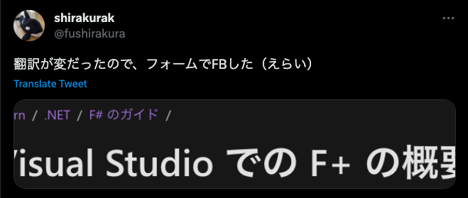

# A snapshot of my first month with F# and SharpLogic

This is the presentation material of the event [【第10回】FUN FAN F#](https://fun-fan-fsharp.connpass.com/event/282666/)

---

# I am

- 白倉賢一（SHIRAKURA Ken'ichi）
- [Link and Motivation Inc.](https://www.lmi.ne.jp/)
  - [Motivation Cloud](https://www.motivation-cloud.com/) Developer

---

# Why F#

- OSS activity
- [F# mathematical logic library](https://github.com/GeorgePlotnikov/SharpLogic)
- [Domain Modeling Made Functional](https://fsharpforfunandprofit.com/books/) ... ?

---

# Explore F#

- F# doesn't seem to be very popular (especially in Japan)
- .NET, Functional Programming, ... ( •̀ω•́ ;  )
- System F

---

Well, let's do it!

---

# 最初にやったこと

- [Codewars](https://www.codewars.com/dashboard)の簡単な問題をいくつか解いた
- 色々なサイトをざっと読んだ

  

---

# [F# mathematical logic library](https://github.com/GeorgePlotnikov/SharpLogic)

```sh
$ cd SharpLogicConsole
$ dotnet run
((P && Q) -> (R <=> ~(S))
...
================
P       Q       R       S       ~(S     (P && Q)        (R <=> ~(S)     ((P && Q) -> (R <=> ~(S))
True    True    True    True    False   True            False           False
True    True    True    False   True    True            True            True
True    True    False   True    False   True            True            True
True    True    False   False   True    True            False           False
True    False   True    True    False   False           False           True
True    False   True    False   True    False           True            True
True    False   False   True    False   False           True            True
True    False   False   False   True    False           False           True
False   True    True    True    False   False           False           True
False   True    True    False   True    False           True            True
False   True    False   True    False   False           True            True
False   True    False   False   True    False           False           True
False   False   True    True    False   False           False           True
False   False   True    False   True    False           True            True
False   False   False   True    False   False           True            True
False   False   False   False   True    False           False           True
```

---

# 必要なこと

- 論理式
- 論理式の複雑さ
- 複雑さの低い順に並べた構成要素のリスト

---

# 論理式

```fs
type Formula =
  | Var of string
  | Const of bool
  | Disj of Formula * Formula
  | Conj of Formula * Formula
  | Neg of Formula
  | Bic of Formula * Formula
  | Impl of Formula * Formula
```

---

# 論理式の複雑さ

```fs
let rec CalcFormulaDepth formula =
  match formula with
  | Var (n) -> 1
  | Disj (n, m) -> 1 + CalcFormulaDepth(n) + CalcFormulaDepth(m)
  | Conj (n, m) -> 1 + CalcFormulaDepth(n) + CalcFormulaDepth(m)
  | Neg (n) -> 1 + CalcFormulaDepth(n)
  | Bic (n, m) -> 1 + CalcFormulaDepth(n) + CalcFormulaDepth(m)
  | Impl (n, m) -> 1 + CalcFormulaDepth(n) + CalcFormulaDepth(m)
  | _ -> 1
```

---

# 構成要素のリスト

```fs
let rec BuildFormulaCalcList formula =
  match formula with
  | Var (n) -> [ Var(n) ]
  | Disj (n, m) ->
    formula
    :: (BuildFormulaCalcList(n) @ BuildFormulaCalcList(m))
  | Conj (n, m) ->
    formula
    :: (BuildFormulaCalcList(n) @ BuildFormulaCalcList(m))
  | Neg (n) -> formula :: BuildFormulaCalcList(n)
  | Bic (n, m) ->
    formula
    :: (BuildFormulaCalcList(n) @ BuildFormulaCalcList(m))
  | Impl (n, m) ->
    formula
    :: (BuildFormulaCalcList(n) @ BuildFormulaCalcList(m))
  | _ -> [ formula ]
```

---

# 並び替え

```fs
let frm = Formula.Impl(Conj(Var "P", Var "Q"), Bic(Var "R", Neg(Var "S")))

let formulaCalcList =
  BuildFormulaCalcList frm
  |> List.sortBy (fun f -> CalcFormulaDepth f)
```

---

# 最後に

- Towards the second month !
- おすすめのnext stepあれば教えてください！
- 一緒にやれそうなことがあればぜひ！
  - OSS, 勉強会, コミュニティ運営, ...

---

# Thank you!
