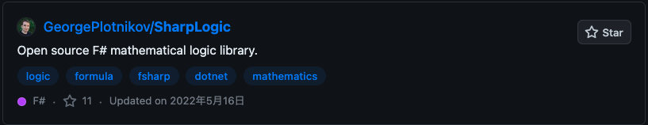
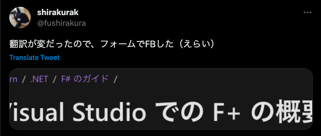

# A snapshot of my first month with F# and SharpLogic

This is the presentation material of the event [【第10回】FUN FAN F#](https://fun-fan-fsharp.connpass.com/event/282666/)

---

# I am

- 白倉賢一（SHIRAKURA Ken'ichi）
- Engineer of [Motivation Cloud](https://www.motivation-cloud.com/) at [Link and Motivation Inc.](https://www.lmi.ne.jp/)

---

# Why F#

- OSS activity
- [SharpLogic](https://github.com/GeorgePlotnikov/SharpLogic)

  

- F# ...?

---

# Search about F#

- F# doesn't seem to be very popular (especially in Japan)
- .NET, Functional Programming ...　( •̀ω•́ ;  )
- System F

---

Well..., let's do it !!

---

# What we started with

- tried some simple problems in [Codewars](https://www.codewars.com/dashboard)
- read some pages

  

---

# [SharpLogic](https://github.com/GeorgePlotnikov/SharpLogic)（F# mathematical logic library）

```sh
$ cd SharpLogicConsole
$ dotnet run
((P && Q) -> (R <=> ~(S))
...
================
P       Q       R       S       ~(S     (P && Q)        (R <=> ~(S)     ((P && Q) -> (R <=> ~(S))
True    True    True    True    False   True            False           False
True    True    True    False   True    True            True            True
True    True    False   True    False   True            True            True
True    True    False   False   True    True            False           False
True    False   True    True    False   False           False           True
True    False   True    False   True    False           True            True
True    False   False   True    False   False           True            True
True    False   False   False   True    False           False           True
False   True    True    True    False   False           False           True
False   True    True    False   True    False           True            True
False   True    False   True    False   False           True            True
False   True    False   False   True    False           False           True
False   False   True    True    False   False           False           True
False   False   True    False   True    False           True            True
False   False   False   True    False   False           True            True
False   False   False   False   True    False           False           True
```

---

# what I need

1. Formula
2. Depth of formula
3. List of the components of formula

---

# 1. Formula

```fs
type Formula =
  | Var of string
  | Const of bool
  | Disj of Formula * Formula
  | Conj of Formula * Formula
  | Neg of Formula
  | Bic of Formula * Formula
  | Impl of Formula * Formula
```

- Recursive discriminated unions

---

# 2. Depth of formula

```fs
let rec CalcFormulaDepth formula =
  match formula with
  | Var (n) -> 1
  | Disj (n, m) -> 1 + CalcFormulaDepth(n) + CalcFormulaDepth(m)
  | Conj (n, m) -> 1 + CalcFormulaDepth(n) + CalcFormulaDepth(m)
  | Neg (n) -> 1 + CalcFormulaDepth(n)
  | Bic (n, m) -> 1 + CalcFormulaDepth(n) + CalcFormulaDepth(m)
  | Impl (n, m) -> 1 + CalcFormulaDepth(n) + CalcFormulaDepth(m)
  | _ -> 1
```

- Recursive Function
- Pattern Matching

---

# 3. List of the components of formula

```fs
let rec BuildFormulaCalcList formula =
  match formula with
  | Var (n) -> [ Var(n) ]
  | Disj (n, m) ->
    formula :: (BuildFormulaCalcList(n) @ BuildFormulaCalcList(m))
  | Conj (n, m) ->
    formula :: (BuildFormulaCalcList(n) @ BuildFormulaCalcList(m))
  | Neg (n) -> 
    formula :: BuildFormulaCalcList(n)
  | Bic (n, m) ->
    formula :: (BuildFormulaCalcList(n) @ BuildFormulaCalcList(m))
  | Impl (n, m) ->
    formula :: (BuildFormulaCalcList(n) @ BuildFormulaCalcList(m))
  | _ -> [ formula ]
```

- `::`, `@`

---

# Sort

```fs
let frm = Formula.Impl(Conj(Var "P", Var "Q"), Bic(Var "R", Neg(Var "S")))

let formulaCalcList =
  BuildFormulaCalcList frm
  |> List.sortBy (fun f -> CalcFormulaDepth f)
```

- `|>`

---

# SharpLogic

```sh
$ cd SharpLogicConsole
$ dotnet run
((P && Q) -> (R <=> ~(S))
...
================
P       Q       R       S       ~(S     (P && Q)        (R <=> ~(S)     ((P && Q) -> (R <=> ~(S))
True    True    True    True    False   True            False           False
True    True    True    False   True    True            True            True
True    True    False   True    False   True            True            True
True    True    False   False   True    True            False           False
True    False   True    True    False   False           False           True
True    False   True    False   True    False           True            True
True    False   False   True    False   False           True            True
True    False   False   False   True    False           False           True
False   True    True    True    False   False           False           True
False   True    True    False   True    False           True            True
False   True    False   True    False   False           True            True
False   True    False   False   True    False           False           True
False   False   True    True    False   False           False           True
False   False   True    False   True    False           True            True
False   False   False   True    False   False           True            True
False   False   False   False   True    False           False           True
```

---

# what I learned

✅ Formula（Recursive discriminated unions）
✅ Depth of formula（Recursive Function, Pattern Matching）
✅ List of the components of formula（`::`, `@`）
✅ Sort（`|>`）

---

# Snapshot

- functional programming, I feel rather natural to me
- I didn't find it inconvenient to run the program（`dotnet run` / only VSCode）
- I felt some of the information was outdated

---

# Towards the second month

- What I should do next ?
- Something we could do together ?
  - OSS, Documentation, Community ...
